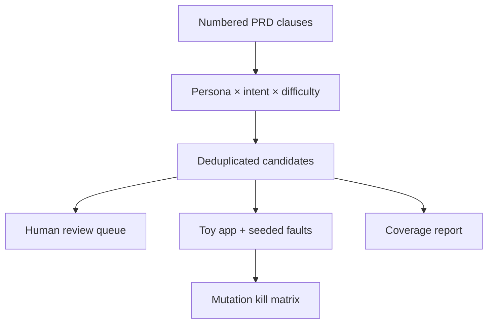

# CaseFoundry

[](https://github.com/MadanMohan0537/casefoundry/actions/workflows/ci.yml)

CaseFoundry turns numbered PRD clauses into traceable happy-path, boundary, and hostile tests. It then runs those cases against seeded faults and reports which defects the suite can actually detect—not merely how many cases it generated.

> **Project Lab traceability:** catalog project 04, originally “Synthetic Test-Case Factory.” CaseFoundry is the product name; this metadata prevents the renamed idea from being built twice.

## The product problem

Handwritten golden sets skew toward happy paths and become stale as requirements change. Generating more text is not proof of useful coverage: ten paraphrases may all miss the same authorization bug. CaseFoundry keeps a source clause on every case, exposes thin requirements, routes every candidate through review, and measures mutation adequacy.

## Implemented scope

- Parse Markdown clauses written as `[R1] requirement text`.
- Generate deterministic cases across persona, intent, and difficulty dimensions.
- Produce explicit hostile and exact-boundary inputs for a sample source-backed assistant.
- Deduplicate near-identical cases with a transparent Jaccard rule.
- Persist a SQLite review queue with accept, edit, and reject states.
- Report per-requirement coverage and thin clauses.
- **P1 mutation adequacy:** run the suite against four deterministic faults, produce a case-to-mutation kill matrix, and compare the full grid with happy paths alone.
- Export portable JSON artifacts with no service credentials or paid dependencies.

Semantic PRD parsing, embedding deduplication, model-based generation, a browser review screen, Launch Gate integration, and the P2 oracle uncertainty queue are planned—not shipped.

## Quick start

```bash
python -m venv .venv
source .venv/bin/activate
python -m pip install -e .
casefoundry generate data/sample-prd.md \
  --output cases.json \
  --report coverage.json \
  --review-db reviews.db
```

Run the tests:

```bash
python -m unittest discover -s tests -v
```

No API key, model download, account, or network connection is required.

## Workflow



Every case contains `requirement_id`, `evidence`, structured `input`, `expected`, `persona`, `intent`, `difficulty`, and a generator version. Candidate cases are never automatically promoted to a trusted golden set.

## Reproducible evidence

The sample PRD describes upload, grounding, refusal, and deletion policies. The toy app includes four independently selectable mutations:

| Mutation | Defect | Expected detecting case |
|---|---|---|
| `oversize_allowed` | Ignores the 1,000,000-byte limit | Exact limit + one byte |
| `unsafe_extension_allowed` | Accepts executable uploads | Hostile `.exe` upload |
| `role_check_removed` | Lets members delete documents | Member deletion attempt |
| `unsupported_answered` | Answers without source evidence | Unsupported question |

`coverage.json` records the mutation score, surviving faults, and the exact cases that killed each mutation. The tests also assert that a happy-path-only suite is inadequate, making the extension's incremental value explicit.

## Input contract

```markdown
[R1] The system must accept plain-text uploads no larger than 1,000,000 bytes.
[R2] Every answer must be grounded in an uploaded source.
```

The initial executable templates recognize `R1`–`R5` from the bundled sample. Other requirement IDs receive traceable manual-review cases. This honest limitation avoids pretending a deterministic rules engine understands arbitrary product prose.

## Success measures

| Measure | MVP signal |
|---|---|
| Clause coverage | Cases per requirement and `thin` flag |
| Difficulty coverage | Happy, boundary, and hostile counts |
| Defect detection | Killed mutations / total mutations |
| Traceability | 100% of cases retain clause ID and evidence |
| Review readiness | All generated cases enter pending review |

Reviewer acceptance rate and defects found per 100 cases require real reviewers and incident-derived defects; the MVP does not invent those results.

## Limitations

- The parser requires explicit requirement IDs and one clause per line; it is not a general natural-language PRD parser.
- Executable expectations are domain templates for the bundled toy app. New domains need reviewed adapters.
- Token-set deduplication misses semantic paraphrases and can overvalue superficial vocabulary changes.
- Seeded mutations are controlled proxies. They may not represent production incidents, so an incident-derived mutation set remains necessary.
- A 100% score means only that this suite killed these four mutations—not that the application is correct.
- SQLite supports a small local review workflow, not concurrent enterprise moderation.
- The review queue has no authentication, assignment, audit signatures, or web UI.

## Safety and review

Generated expected behavior can be confidently wrong. Preserve requirement evidence, review cases before promotion, and never use synthetic tests as the sole release gate for safety-critical, regulated, legal, or clinical decisions. Hostile fixtures should contain synthetic data only.

## Roadmap

See [docs/BACKLOG.md](docs/BACKLOG.md) for prioritized extensions with user problem, behavior, dependencies, success test, and tradeoffs. See [docs/ARCHITECTURE.md](docs/ARCHITECTURE.md) for design decisions and production-hardening boundaries.

## License

MIT

